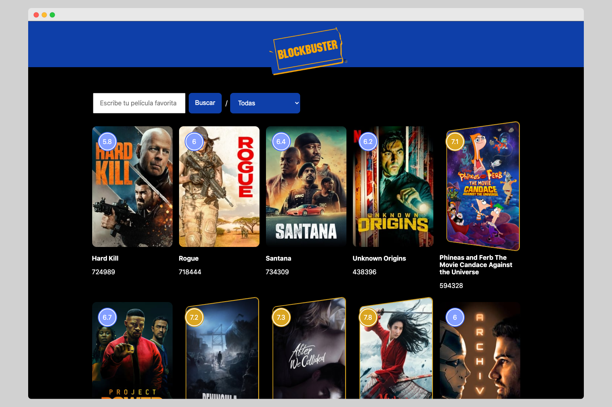

# Block Buster Pseudo React

Pseudo Reat was created with vanilla JavaScript, UI clone of the blockbuster, with tagged template I create my own library for custom styles. I connect to The API of www.themoviedb.org for rendering the movies.

## Screenshoot 📸

## Deploy 👀

[see proyect](https://striped-nextjs.vercel.app/)

## Technologies 🧰

- Html5
- Css
- JavaScript
